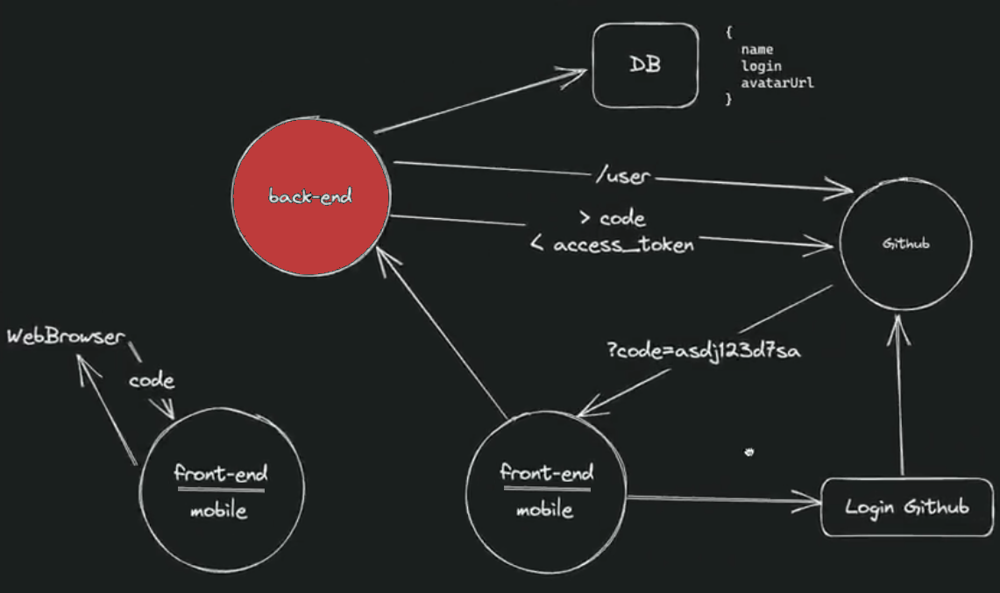
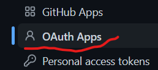
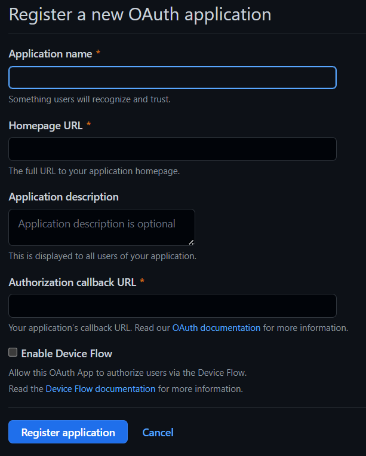

# Space Time - Server
## Rede Social para Devs

Aqui temos a camada back-end do aplicativo que tem como objetivo permitir o registro de um acontecimento através de um post informando uma imagen/vídeo e um texto descrevendo o fato.

Teremos no back-end a autenticação do usuário, a permissão de rotas e o logout do usuário, o upload dos arquivos de imgem armazenando em disco (ideal seria um serviço na núvem), bem como os end-points para criar, editar, excluir ou deletar uma memória.

<a name="ancora"></a>
- [Techs](#techs)
- [Arquitetura](#arch)
- [Funcionalidades](#features)
- [Criar Tabelas no Banco](#database)
- [Instação e Execução](#install)
- [End-Points](#endPoints)
- [Registrar Aplicação OAuth - Github ](#registroGithub)

<a id="techs"></a>
## Techs 
- node
- axios
- fastify
  - @fastify/cors
  - @fastify/jwt
  - @fastify/multipart
  - @fastify/static
  - @prisma/client
- prisma / SQLite
- typescript
- tsx
- dotenv
- eslint
- zod

----
<a id="arch"></a>
## Arquitetura do projeto / Autenticação OAuth (Github)

A seguir descrevemos as etapas para a autenticação dos clientes (web/mobile) no Github.

1. No cliente (web/mobile), ao clicar em "Criar sua conta", a aplicação aciona o Github com o "GITHUB_CLIENT_ID" préviamente registrado;
2. Após auntenticação no github, ele fornece um código que é enviado para o end-point `/register`;
3. Aqui no back-end, o código recebido do cliente é enviado para o github juntamente como `client_id` e `client_secret` que estão nas variáveis de ambiente;
4. O github devolve um `access_token` e com ele nós fazemos uma chamada na api do git (`https://api.github.com/user`) para pegar os dados do usuário;
5. Neste momento, é verificado no bando de dados do server se este usuário já é cadastrado. Caso não seja, o server registra no banco e em seguida retorna um `access_token` para a chamada do cliente (web/mobile) confirmando a autenticação.

Após este processo, de posse do `access_token`, os clientes poderão realizar chamadas a api do back-end.



------
<a id="featurea"></a> 
## Funcionalidades / Endpoints (api)

host:  http://localhost:3333
- [x] Login / Registro - `POST /retister`
- [x] Inclusão de memória - `POST /memories`
- [x] Listagem de memória - `GET /memories`
- [x] Edição de memória - `PUT /memories/id` 
- [x] Deleção de memória - `DELETE /memories/id`
- [] Filtro de data

----
<a id="requisitos"></a>

## Pré-requisitos
- node versão >= 16.16.0
- npm versão >= 5.2.0 (já trás o npx)
- npx
- Registrar aplicação OAuth no Github [Veja como](#registroGithub) &darr;
- Criar tabelas no banco

----
<a id="database"></a>
## Criação das Tabelas

```
DATABASE_URL="file:./data/dev.db"
```
----
<a id="install"></a>
## Como Instalar e Rodar a Aplicação

Para instalar e roda o servidor node basta seguir os passos descritos abaixo:
1. Clonar o projeto: 
```
    git clone https://github.com/esbnet/nlw-spacetime-server.git
```
2. Entrar na pasta do projeto:  
```
    cd nlw-spacetime-server
```
3. Instalar dependências: 
```
    npm install
```
4. Criar as tabelas no bando de cados: 
```
    npx prisma migrate
```
6. Criar na pasta raiz o arquivo `.env` e configurar as credencias geradas no gitrub. Será necessário uma credencial para o acesso via web e outra para acesso via mobile. (Registrar aplicação OAuth no Github [Veja como](#registroGithub) &darr;)
```
    # para aplicação web
    GITHUB_CLIENT_ID_WEB={seu código aqui}
    GITHUB_CLIENT_SECRET_WEB={seu código aqui}

    # para aplicação mobile
    GITHUB_CLIENT_ID_APP={seu código aqui}
    GITHUB_CLIENT_SECRET_APP={seu código aqui}

```
5. Rodar o aplicativo: 
```
    npm run dev
```
7. Criar a variável: 
```
    NEXT_PUBLIC_GITHUB_CLIENT_ID=código_client_id_gerado_no_git
```
8. Criar a variável contendo endereço e porta do servidor (back-end/api)
```
    NEXT_PUBLIC_SERVER_URL=http://0.0.0.0:3333
```
----
<a id="Registrar"></a>
## Login / Registro

Ao logar no aplicativo você obtêm sua lista de memórias registradas e está pronto para matar a saudade ou registrar novas memórias.


## Inclusão de memória

Clique em adicionar mídia, ecolha uma imagem que represente o momento, informe se irá ficar pública ou não, descreva o momento com os detalhes que achar necessário e clique em salvar. Pronto!😎 Sua memória foi registrada e poderá recordá-la sempre que sentir vontade.


-----
<a id="registroGithub"></a>
## Registrar aplicação OAuth no Github 

Abaixo você encontra o passo-a-passo para criar as credencias para que sua aplicação possa realizar a autenticação via Github.

Atalho:
[https://github.com/settings/applications/new](https://github.com/settings/applications/new)

| Passos      |tela        |
| ----------- |:-------------:|
| 1. Clique em settins||
| 2. Clique em Developer settings||
| 3. Clique em OAuth||
| 4. Clique em New OAuth App||
| 5. Preencha os campos com os dados abaiso: <br>spacetime-web<br>http://localhost:3000<br>(opcional)<br>http://localhost:3000/ (para onde será redirecionado após o login)||

Consulte a documentaçãod o github para mais detalhes:
[Autorizando Aplicativos OAuth](https://docs.github.com/pt/apps/oauth-apps/building-oauth-apps/authorizing-oauth-apps)